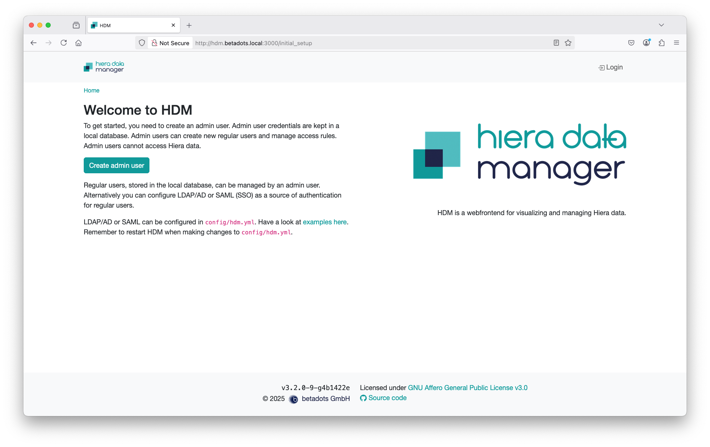
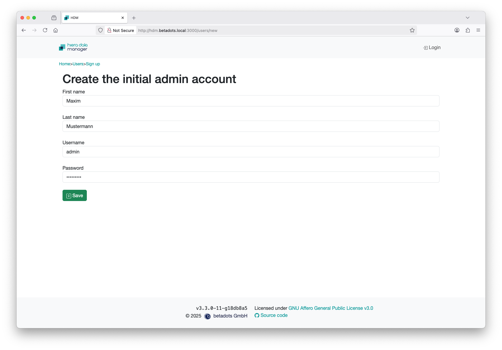
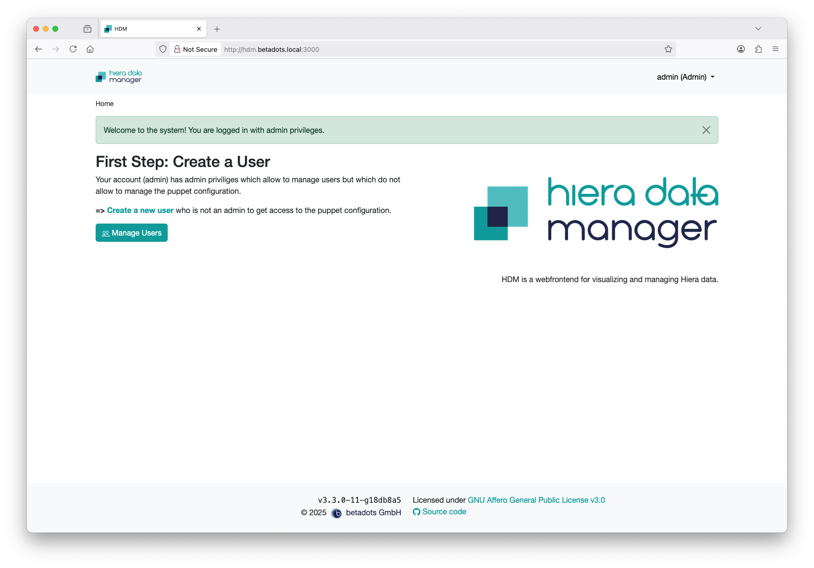
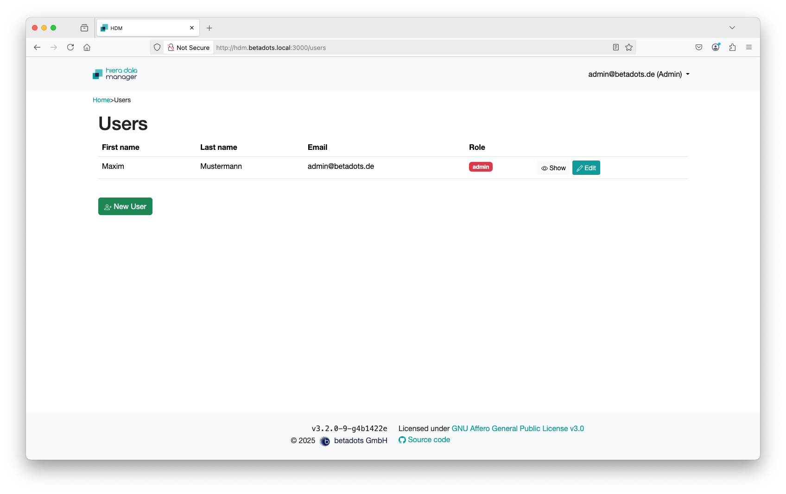
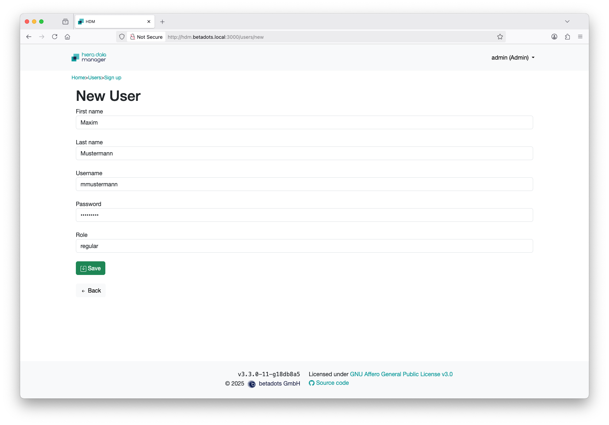
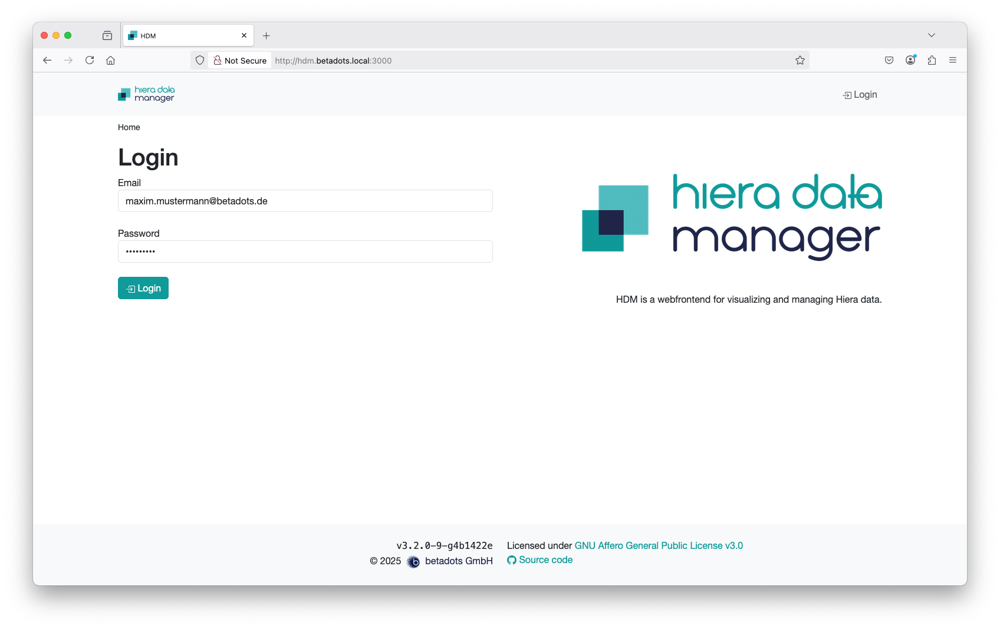

# User Management

Now that the installation is complete, the configuration with SQLite Backend first requires the creation of an admin account.

If you have selected the ‘Create admin user’ button, you have to enter the natural name for the new admin user, consisting of first and last name, an login name (previously only the email address, still possible of course) and a password of at least 9 characters.

Admin accounts are only authorized to manage users, not to access the hiera data. Therefore, another non-admin user has to be created, which will later be used to access hiera.

You proceed as with the admin by entering your first and last name, login name and password. Here also former the mail address serves as the login name. Choose 'regular' as role. If you choose admin, a second admin account will be created. This account will also not have any access to hiera.

The menu, which can be accessed via your login name at the top right-hand corner, allows you to leave (Logout), customize your profile (Edit Profile), create a new user, switch to the user list (List users) or to the group view (List Groups).

Now log out to switch to a regular user or [manage some groups](04_Group-Management.md) before.

