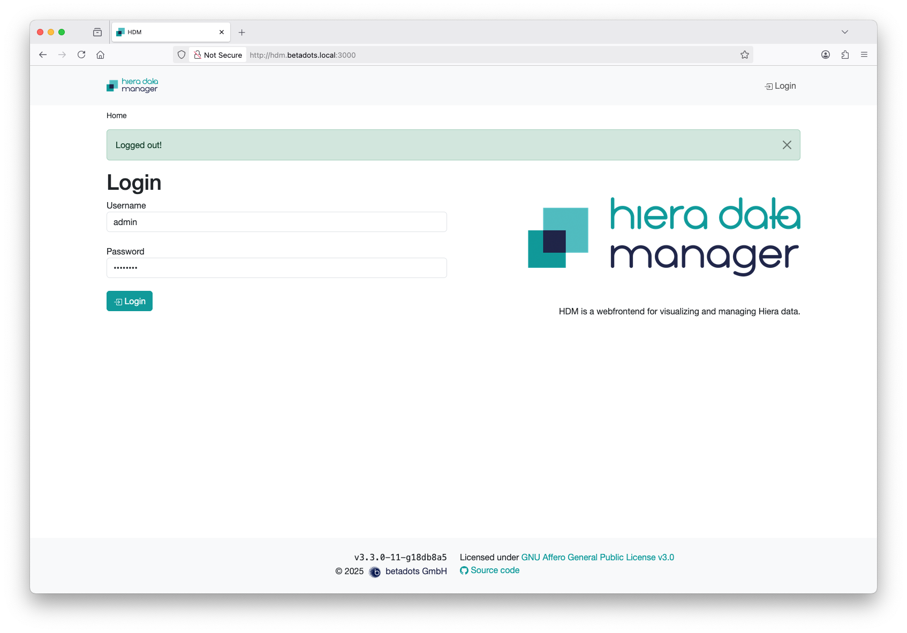
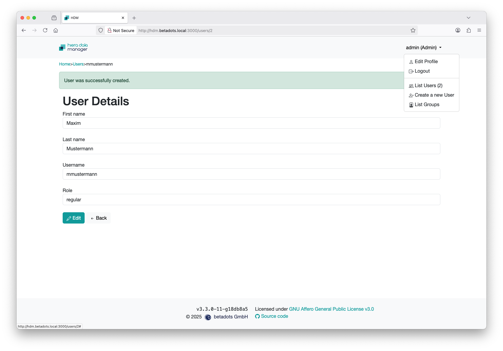
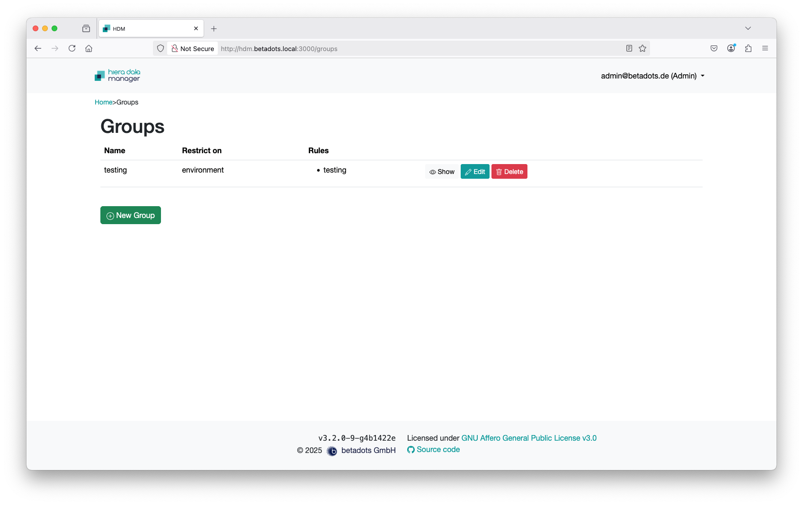
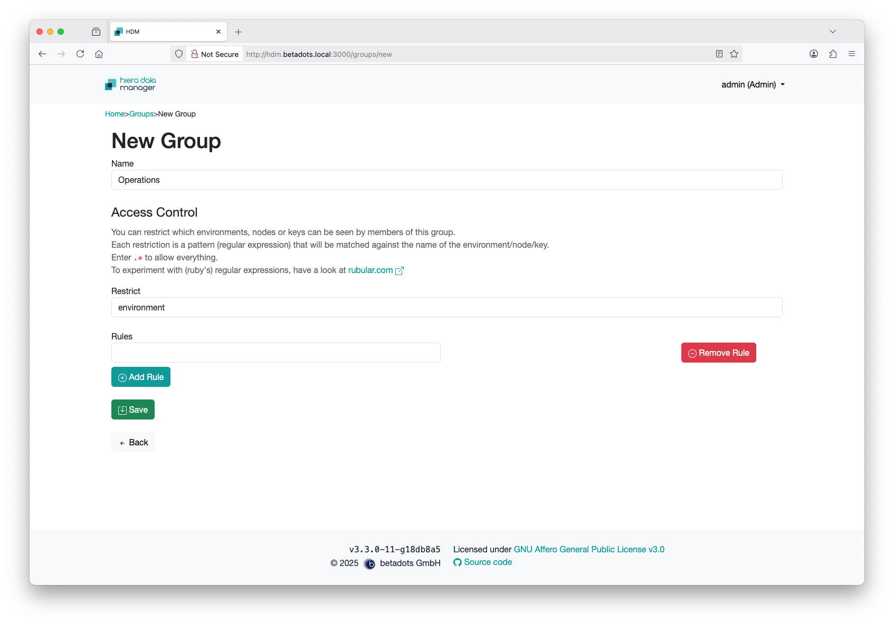
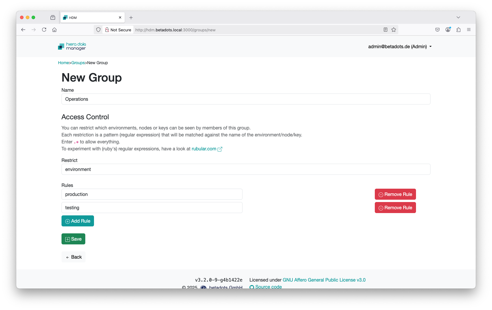
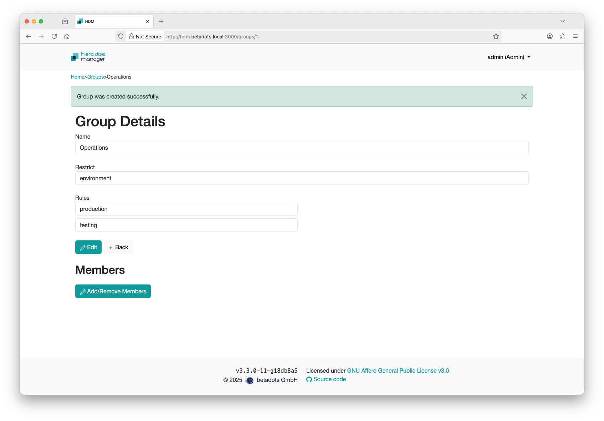
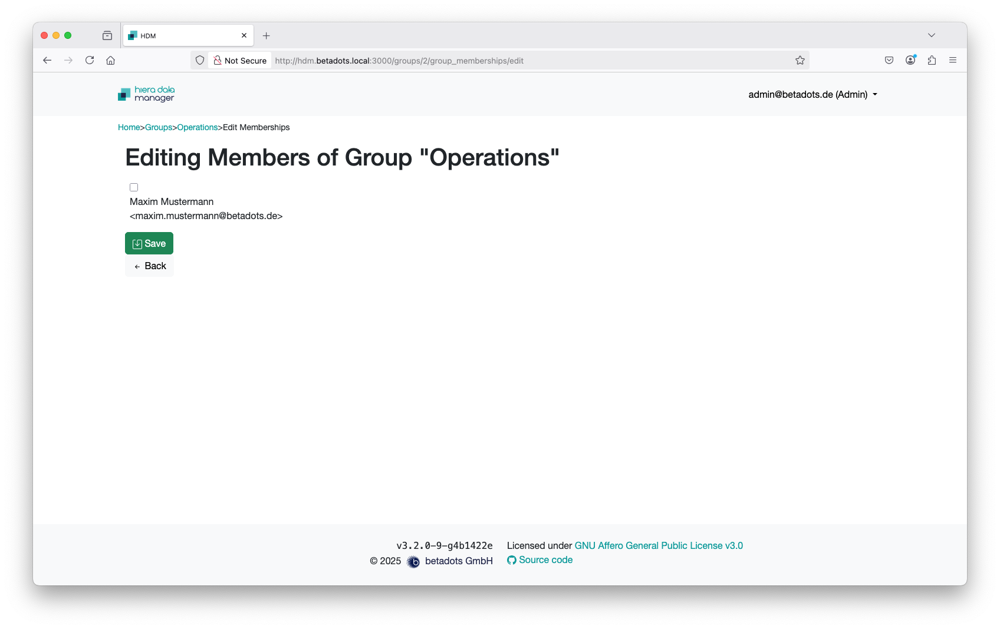

# Group Management

Login to HDM as a user belonging to role 'admin'.

Switch via 'List Groups' in the menu at the right top-hand to the list of groups.

If you start with a blank setup, this list is empty of course. By pushing 'Edit' switches to the editing mode of the group, 'Delete' removes the group. To add a new group bush the button 'New Group'.

In addition to a name for the new group, it has a restriction for which there can be several rules. The restriction with its rules can refer to environments, nodes or keys of Hiera data.

Here the decision was made in favor of Environment. Each rule is a pattern ([ruby regular expression](https://rubular.com)) that will be matched against the name of the environment (or node/key). Further rules can be added by pushing 'Add Rule'. Individual rules can be removed again by pushing 'Remove Rule' on the right.

Press 'Save' to store changes or create the group.

After the group has created you, you are still in the editing mode of this group. Users can now be added to or removed from the group with pushing 'Add/Remove Members'.

For the users displayed, an activated checkbox for their name means that they are a member of the group. If the box is empty, the user is not a member of the group.

Pushing 'Save' adopts the changes made.

To combine several restrictions on environments/nodes/keys, different groups have to be used, each of which the user has to belong to.
