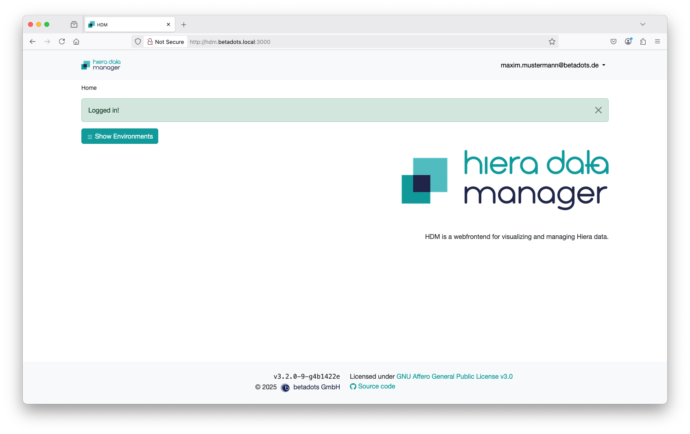
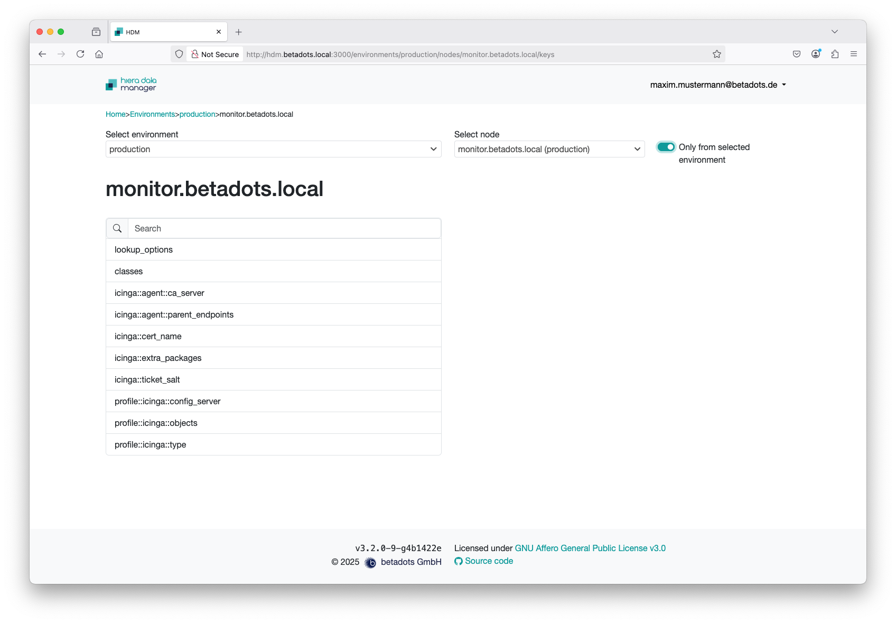
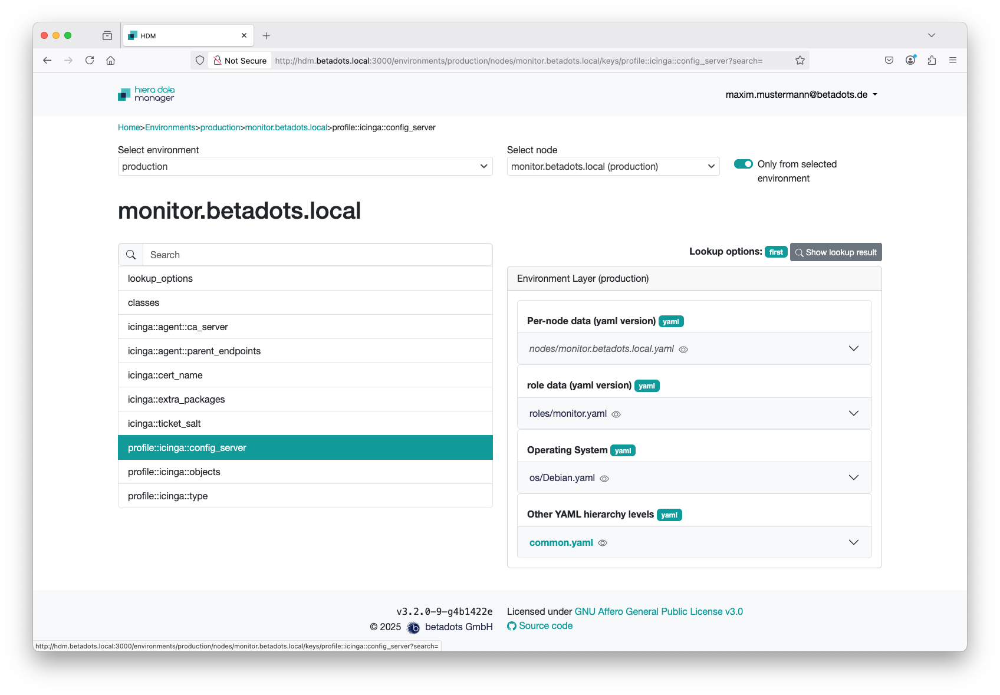
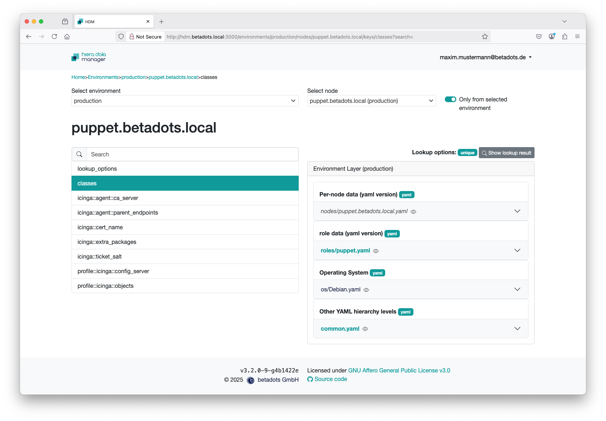
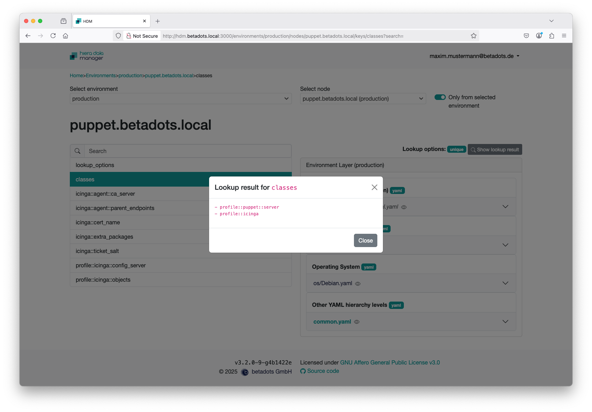
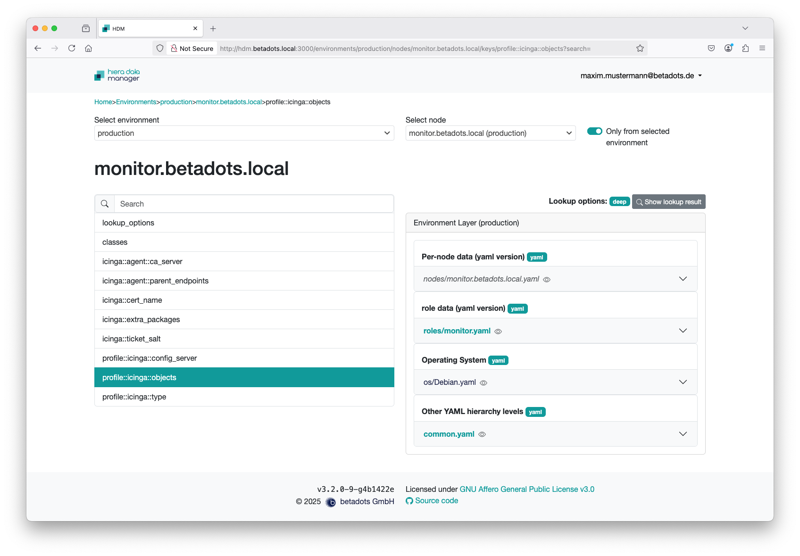
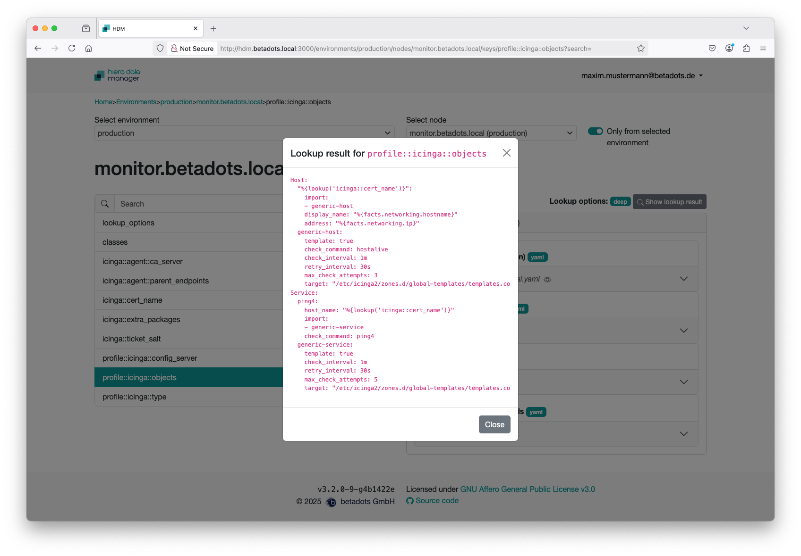

# Browse Hiera Data

Login as an user belonging to role regular.

After successful access, you will first be asked to choose an environment.

Once you have selected an environment, all of its keys are displayed in the left-hand window area and a drop-down box appears to the right of the environment for selecting the desired node. Right next to it, the default setting is that only nodes from the selected environment can be selected.

As soon as you select a key from the list on the left, the relevant hierarchy levels (environment layers) appear to the right of this list. Files in which the key you are looking for does not exist are displayed in unadjusted font. Files that do not even exist, on the other hand, are shown in recursive font and those in which the key is actually set are highlighted in bold. The value set in this file is displayed as soon as the corresponding area is expanded.

If you are only interested in the final value, you only need to select the 'Show lookup result' button above. This is the only way to get a merged result that is not based on the 'first' lookup option (e.g. 'unique' or 'deep merge').

The following image shows the merged result via 'unique' for the classes key. The values come from the two files ‘roles/puppet.yaml’ and ‘common.yaml’.

A more complex result for a deep merged result follows:

